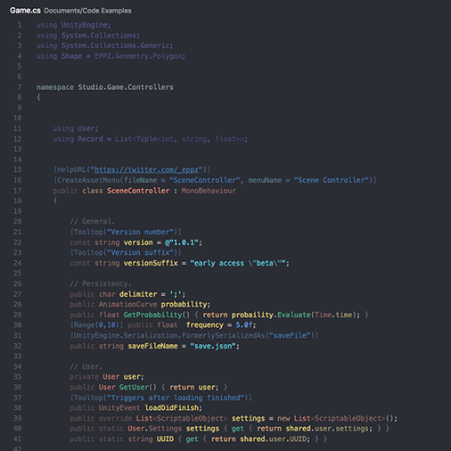
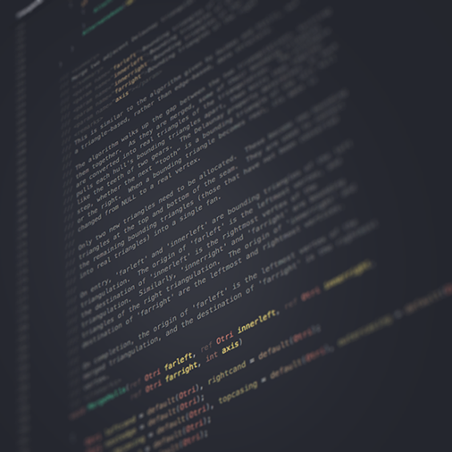
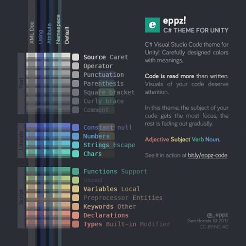

# eppz! (C# theme for Unity)

**Carefully designed** colors with meanings.

Colored code regions: `using`, `namespace`, `attribute` and XML Documentation.

**Code is read more than written.** 
Visuals of your code deserve attention.

### License

* [Creative Commons Attribution-NonCommercial 4.0 CC BY-NC](https://creativecommons.org/licenses/by-nc/4.0/legalcode)

### More

* Contributed by Geri Borbás [@_eppz](http://twitter.com/_eppz)
* Repository at [eppz/VSCode.Extension.eppz_Code](https://github.com/eppz/VSCode.Extension.eppz_Code.git)
* Theme is the C# adaptaion of the orginal iOS countepart [eppz/iOS.Library.eppz_xCode](https://github.com/eppz/iOS.Library.eppz_xCode)
