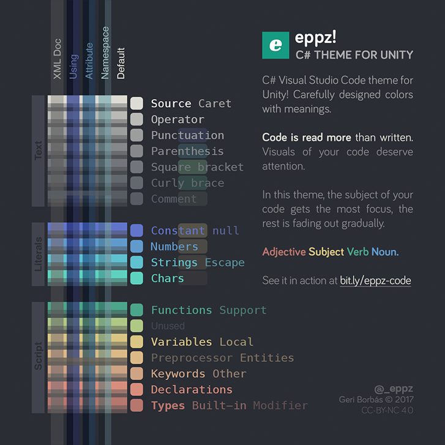

# eppz! (C# theme for Unity)

Distinct colors for `Unity` classes and types.

Colored code regions: `using`, `namespace`, `attribute` and more.

**Markdown** coloring (like `CHANGELOG.md`, `README.md`).

**XML Documentation** coloring.

**Code is read more than written.** 
Visuals of your code deserve attention.

### License

* [Creative Commons Attribution-NonCommercial 4.0 CC BY-NC](https://creativecommons.org/licenses/by-nc/4.0/legalcode)

### More

* Contributed by Geri Borbás [@_eppz](http://twitter.com/_eppz)
* Repository at [eppz/VSCode.Extension.eppz_Code](https://github.com/eppz/VSCode.Extension.eppz_Code.git)
* Theme is the C# adaptaion of the orginal iOS countepart [eppz/iOS.Library.eppz_xCode](https://github.com/eppz/iOS.Library.eppz_xCode)

### Privacy Policy

The extension uses Google Analytics to collect **anonymous basic usage** metrics (See more on [GitHub](https://github.com/eppz/VSCode.Extension.eppz_Code/search?utf8=%E2%9C%93&q=path%3Asrc+Analytics&type=)). Data is used solely to shape the development roadmap. You can opt out any time using `eppz-code.analytics` configuration setting.